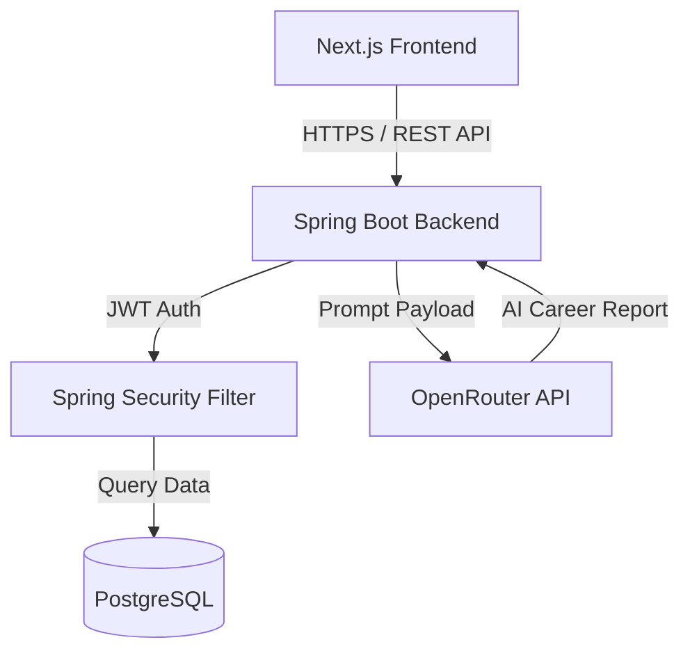
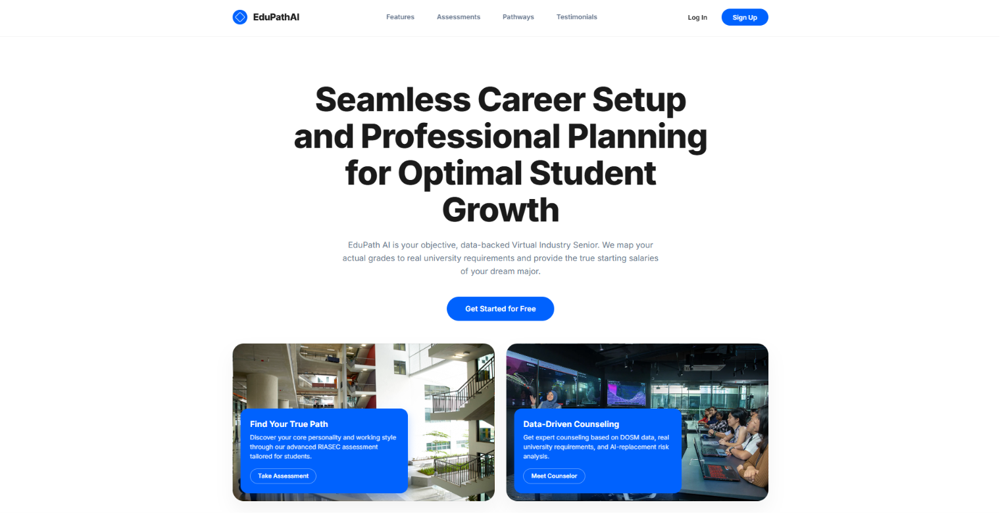
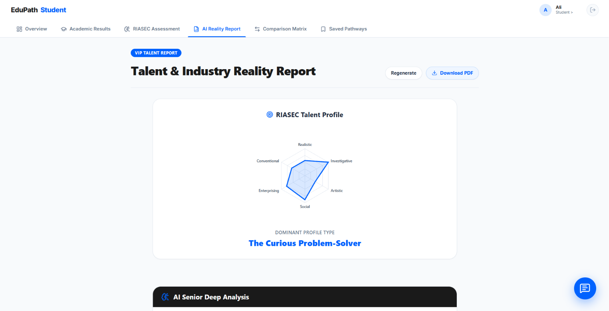

<div align="center">
  
  <h1>EduPath AI</h1>
  <p><strong>A Data-Driven Virtual Industry Center for Academic & Career Planning</strong></p>
  
  <p>
    <a href="https://capstone-project-edu-path-ai.vercel.app/" target="_blank">
      
    </a>
    
    
    
  </p>
</div>

---

## 📖 Overview

**EduPath AI** is an intelligent, data-backed career and academic planning platform designed to bridge the gap between student grades, university requirements, and actual industry demands. By leveraging the **OpenRouter API** and the **RIASEC personality model**, it provides highly personalized, objective insights to students, while equipping counselors and administrators with robust monitoring tools.

> **Note on Live Demo**: The live project is hosted on free tiers (Vercel for Frontend, Render for Backend/Database). Due to inactivity limits, the database might occasionally be paused or expired. If you cannot log in, the backend database might be asleep—please allow up to 60 seconds for cold starts, or run the project locally.

## ✨ Key Features

- 🎓 **Student Portal**:
  - **Academic Matrix**: Input grades (SPM/UEC) and tuition budget constraints.
  - **RIASEC Personality Assessment**: Discover dominant career traits.
  - **AI Reality Report**: Receive an AI-generated report evaluating realistic career paths and expected starting salaries based on combined academic and personality data.
- 🧑‍🏫 **Counselor Portal**: Dashboard to monitor student progress, review AI reports, and provide human-in-the-loop guidance.
- ⚙️ **Admin Portal**: System-wide oversight and user management.
- 🔐 **Role-Based Access Control (RBAC)**: Secure routing and JWT authentication distinguishing Students, Counselors, and Admins.

## 🔑 Demo Credentials

You can test the application using the following sample accounts:

| Role | Username | Password |
| :--- | :--- | :--- |
| **Admin** | `Heng` | `345765` |
| **Counselor** | `Sheila` | `123456` |
| **Student** | `Ali` | `123456` |
| **Student** | `Mei Ling`| `123456` |
| **Student** | `Ahmad` | `123456` |

*Visit the [Live Application](https://capstone-project-edu-path-ai.vercel.app/) to try them out!*

## 🛠️ Tech Stack

### Frontend
- **Framework**: Next.js (App Router), React
- **Styling**: Material-UI (MUI), Emotion
- **State Management**: React Context, Axios
- **Deployment**: Vercel

### Backend
- **Framework**: Spring Boot (Java 17)
- **Security**: Spring Security, JWT (Stateless Authentication)
- **Database**: PostgreSQL (managed on Render)
- **AI Integration**: OpenRouter API
- **Deployment**: Render

## 🧩 Architecture Flow



## 📸 Screenshots

*(Replace the placeholders below with actual screenshots of your project)*

| Student Dashboard | AI Reality Report |
| :---: | :---: |
|  |  |
| *Personalized overview with RIASEC dominance* | *Data-driven insights from OpenRouter API* |

## 🚀 Getting Started (Local Development)

### 1. Clone the repository
```bash
git clone https://github.com/ooideshen/Capstone-Project-EduPath-AI.git
cd Capstone-Project-EduPath-AI
```

### 2. Setup Backend
```bash
cd backend
# You will need to setup a local PostgreSQL database and update application.properties
# Set environment variables:
# JWT_SECRET=your_secret
# OPENROUTER_API_KEY=your_openrouter_key

./mvnw spring-boot:run
```

### 3. Setup Frontend
```bash
cd ../frontend
# Set environment variables in .env.local:
# NEXT_PUBLIC_API_URL=http://localhost:8080

npm install
npm run dev
```

## 📄 License
This project is licensed under the MIT License - see the [LICENSE](LICENSE) file for details.
